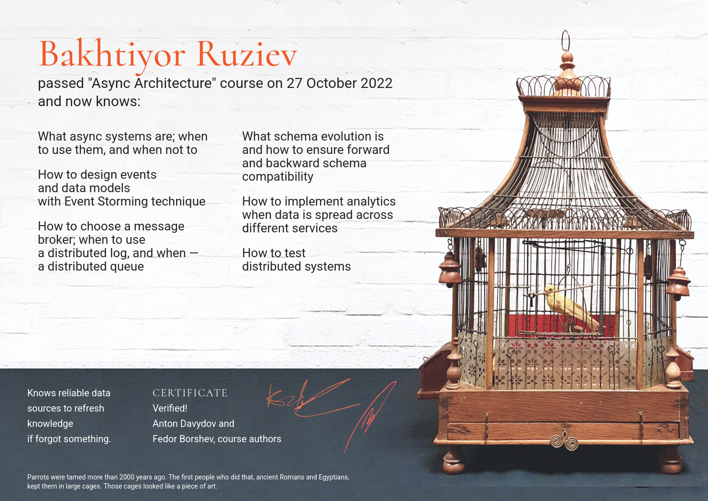

Hi there

here some updates:
<!--more-->

* 🇹🇯 Moved to Dushanbe, Tajikistan because is my POB 
* I worked in a startup and it's dead 'cause of bad finance decision
* I returned my previous company where I worked, but to another department
* Everyday I try to complete tasks in leetcode. Here is my [account](https://leetcode.com/theruziev/)
* 🇰🇿 Moved to Almaty, Kazakhstan (very beautiful place and people)
* Founded bugs in frontend open source libraries which I use and fixed these. There are my first PRs for frontend projects:
  * https://github.com/vueuse/vueuse/pull/2761
  * https://github.com/inkline/inkline/pull/333
* I finished course "Async Architecture" from
[Tough developers course](https://education.borshev.com/)

